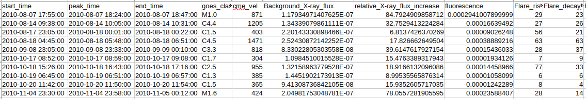

# CME Speed Prediction via Time Series Analysis

In this study, we investigate **CME speed prediction** using two primary data sources:
1. **GOES Soft X-ray Flux Time Series** data
2. **Flare Features** derived from X-ray time series

Our approach follows a **supervised machine learning** framework, where CME speed is used as the label. For binary classification, we binarize CME speed with a threshold of **500 km/s**. The dataset is constructed from the **GOES flare catalog** and **GOES soft X-ray flux** data. A sample of the dataset is shown below:

### Flare Features
We extract **12 flare-related features** from the GOES flare data, listed below:

- **cme_vel**: CME velocity (target variable)
- **goes_class_num**: Maximum intensity of the flare
- **Background_X-ray_flux**: Background X-ray flux level
- **relative_X-ray_flux_increase**: Ratio of maximum intensity to background X-ray flux
- **fluorescence**: Area under the curve of soft X-ray flux (from flare start to end)
- **Flare_rise_time**: Time from flare start to peak
- **Flare_decay_time**: Time from peak to flare end
- **Flare_duration**: Total flare duration (end time minus start time)
- **rise_gradient**: Intensity gradient during the rise phase (change in intensity divided by rise time)
- **decay_gradient**: Intensity gradient during the decay phase (change in intensity divided by decay time)
- **avg_fluorescence**: Fluorescence per unit time (total fluorescence divided by flare duration)
- **avg_rise_fluorescence**: Fluorescence during the rise phase, normalized by rise time
- **avg_decay_fluorescence**: Fluorescence during the decay phase, normalized by decay time

### Contact
For access to the dataset or further inquiries, please reach out to: **jhong36@gsu.edu**
